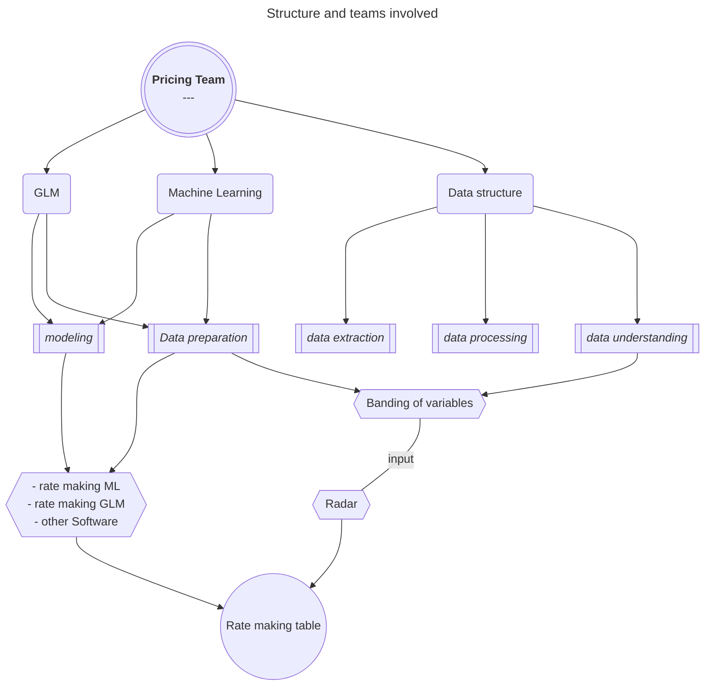
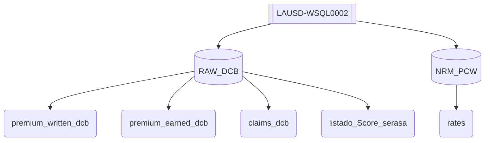

# Rate making-Brazil

---



## Index

1. [Data extraction](#data-extraction)
2. [Data processing](#data-processing)
3. [Data understanding](#data-understanding)
    - [General EDA](#general-eda)
    - [Analysis by frequency and severity](#analysis-by-frequency-and-severity)
4. [Data preparation](#data-preparation)
    - [Preparation for GLM](#preparation-for-glm)
    - [Preparation for ML](#preparation-for-ml)
5. [modeling](#modeling)
    - [GLM modeling](#glm-modeling)
    - [ML modeling](#ml-modeling)
6. [Rate making table](#rate-making-table)

---

### Data Extraction

The available information is stored on server "LAUSD-WSQL0002", and the databases "RAW_DCB" and NRM_PCW. The tables needed are presented below:



Below we have a preview of tables premium_written_dcb and claims_dcb for policy 1160025001, with the corresponding columns:

#### premium_written_dcb

| Tabla    | POLICY_NUMBER | LOCATION_ID | LMI | RUBRICA | TABELA   | APOLICE_DATA_INICIO_VIGENCIA | APOLICE_DATA_FIM_VIGENCIA | RENEWAL_POLICY | ANTIGUEDAD | RENEWED_UW_YEARMONTH | Acct_Period | TIPO_EMISION | PRODUCT_NAME   | REGION                 | MACRO_REGION | INDUSTRY               | OCCUPANCE                                           | FLAG_MULTILOCATION | COD_LOC_INC | COD_LOC_ALAG | COD_LOC_ROUB | COD_LOC_DELETR | CD_NAICS    | NAICS_GROUP | NAICS_OLD_GROUP             | NAICS_DESCRIPTION                                                                         | COVERAGE          | TIPO_POLIZA | RENEWED_PREMIUM_ORIG | RENEWED_RISK_GWP_ORIG | RENEWED_RISK_TECH_PREMIUM_ORIG | RENEWED_INSURED_AMOUNT_ORIG | RENEWED_COMISSION_ORIG | RENEWED_DISCOUNT_ORIG | RENEWED_PREMIUM_CON | RENEWED_RISK_GWP_CON | RENEWED_RISK_TECH_PREMIUM_CON | RENEWED_INSURED_AMOUNT_CON | RENEWED_COMISSION_CON | RENEWED_DISCOUNT_CON | RENEWED_PREMIUM_PTD | RENEWED_RISK_GWP_PTD | RENEWED_RISK_TECH_PREMIUM_PTD | RENEWED_INSURED_AMOUNT_PTD | RENEWED_COMISSION_PTD | RENEWED_DISCOUNT_PTD | STATUS_COMISSION | RENEWED_RATE | RENEWED_RATE_INCREASE | RENEWED_LOCALS_QTY | STATUS_LOCALS_QTY | EXP_Anual | Extintores | Hidrantes | Sprinklers | Detectores_de_Fumaça_ou_Calor | CO2_ou_FM200 | Brigada_de_Incendio | Alarme_Local | Alarme_Monitorado_24_Horas | Sistema_de_Filmagem | Vigilancia | Cofre | COTACAO_NUMERO | COTACAO_VERSAO | RAMO  | LOB      | EXPERIENCIA | AD3 | RISK_ISSUED_GWP_FACTOR_ORG | RISK_ISSUED_GWP_FACTOR_CON | RISK_ISSUED_GWP_FACTOR_PTD | COBERTURAID | Zona |
|----------|---------------|-------------|-----|---------|----------|------------------------------|---------------------------|----------------|------------|----------------------|-------------|--------------|----------------|------------------------|--------------|------------------------|-----------------------------------------------------|--------------------|-------------|--------------|--------------|----------------|-------------|-------------|-----------------------------|-------------------------------------------------------------------------------------------|-------------------|-------------|----------------------|-----------------------|--------------------------------|-----------------------------|------------------------|-----------------------|---------------------|----------------------|-------------------------------|----------------------------|-----------------------|----------------------|---------------------|----------------------|-------------------------------|----------------------------|-----------------------|----------------------|------------------|--------------|-----------------------|--------------------|-------------------|-----------|------------|-----------|------------|-------------------------------|--------------|---------------------|--------------|----------------------------|---------------------|------------|-------|----------------|----------------|-------|----------|-------------|-----|----------------------------|----------------------------|----------------------------|-------------|------|
| Suscrita | 1,160,025,001 | 25,026,961  | 0   | 190.43  | Tabela 7 | 2020-08-19                   | 2021-08-19                |                |            | 202008               | 202,008     | NUEVA        | SME CONDOMINIO | SC - OESTE CATARINENSE | SOUTH        | Condomínio Residencial | Condomínio Residencial (21 a 40 anos de Construção) | SINGLE LOCATION    | 2           | 2            | 2            | 6              | 531,110.000 | Real Estate | Real Estate 1 (Residential) | Lessors of Residential Buildings and Dwellings: modern fire resistive or LFR construction | ELECTRICAL DAMAGE | SMALL       | 2,239.250            | 90.000                | 95.630                         | 40000                       | 13.500                 | 20.00000              | 422.134             | 16.966               | 18.028                        | 7,540.640                  | 2.545                 | 3.770                | 416.836             | 16.754               | 17.802                        | 7446                       | 2.513                 | 3                    | 0                | 0.00239      | 0.00000               | 1                  | 0                 | 0         | 1          | 0         | 0          | 0                             | 0            | 0                   | 0            | 0                          | 1                   | 0          | 0     | 25,693,256     | 5              | 16    | SME FIRE | 5           | 1   | 108.000                    | 20.360                     | 20.104                     | 623         | 6    |

#### claims_dcb

| Tabla  | POLICY_NUMBER | LOCATION_ID | EFFECTIVE_DATE | EXPIRE_DATE | RENEWAL_POLICY | ANTIGUEDAD | RENEWED_UW_YEARMONTH | DT_EVENT   | AY_PERIOD | TIPO_EMISION | PRODUCT        | REGION                 | MACRO_REGION | INDUSTRY               | OCCUPANCE                                           | FLAG_MULTILOCATION | COD_LOC_INC | COD_LOC_ALAG | COD_LOC_ROUB | COD_LOC_DELETR | CD_NAICS    | NAICS_GROUP | NAICS_OLD_GROUP             | NAICS_DESCRIPTION                                                                         | COVERAGE          | TIPO_POLIZA | CLAIM_NUMBER  | PAID_ORIG | OSLR_ORIG | IL_ORIG   | ALAE_ORIG | PAID_CON | OSLR_CON | IL_CON  | ALAE_CON | PAID_PTD | OSLR_PTD | IL_PTD  | ALAE_PTD | Extintores | Hidrantes | Sprinklers | Detectores_de_Fumaça_ou_Calor | CO2_ou_FM200 | Brigada_de_Incendio | Alarme_Local | Alarme_Monitorado_24_Horas | Sistema_de_Filmagem | Vigilancia | Cofre | COTACAO_NUMERO | COTACAO_VERSAO | RAMO | LOB      | LMI | RUBRICA | TABELA   | EXPERIENCIA | AD3 | ACCT_PERIOD | DEDUCIBLE_LDG | DEDUCIBLE_CON | DEDUCIBLE_PTD | COBERTURAID | POS_ANTERIOR | VALOR_MINIMO_ANTERIOR | POS_PROPOSTA | VALOR_MINIMO_PROPOSTO | DT_AVISO   | IND_SITUACAO |
|--------|---------------|-------------|----------------|-------------|----------------|------------|----------------------|------------|-----------|--------------|----------------|------------------------|--------------|------------------------|-----------------------------------------------------|--------------------|-------------|--------------|--------------|----------------|-------------|-------------|-----------------------------|-------------------------------------------------------------------------------------------|-------------------|-------------|---------------|-----------|-----------|-----------|-----------|----------|----------|---------|----------|----------|----------|---------|----------|------------|-----------|------------|-------------------------------|--------------|---------------------|--------------|----------------------------|---------------------|------------|-------|----------------|----------------|------|----------|-----|---------|----------|-------------|-----|-------------|---------------|---------------|---------------|-------------|--------------|-----------------------|--------------|-----------------------|------------|--------------|
| CLAIMS | 1,160,025,001 | 25,026,961  | 2020-08-19     | 2021-08-19  |                | 0          | 202008               | 20,200,923 | 202,009   | NUEVA        | SME CONDOMINIO | SC - OESTE CATARINENSE | SOUTH        | Condomínio Residencial | Condomínio Residencial (21 a 40 anos de Construção) | SINGLE LOCATION    | 2           | 2            | 2            | 6              | 531,110.000 | Real Estate | Real Estate 1 (Residential) | Lessors of Residential Buildings and Dwellings: modern fire resistive or LFR construction | ELECTRICAL DAMAGE | SMALL       | 0301620008220 | 2,212.660 | 0.000     | 2,212.660 | 4,425.320 | 449.818  | 0.000    | 449.818 | 899.637  | 450.113  | 0.000    | 450.113 | 900.225  | 1          | 0         | 0          | 0                             | 0            | 0                   | 0            | 0                          | 1                   | 0          | 0     | 25,693,256     | 5              | 16   | SME FIRE | 0   | 190.43  | Tabela 7 | 5           | 1   | 202,310     | 0.000         | 0.000         | 0.000         | 632         |              |                       |              |                       | 20,201,015 | ADM          |
---

##### Electrical damage

We will start doing the complete modeling of the coverage Electrical Damage. After reviewing the available information we will choose the following columns in our process.

###### policies table

| column_name                   | polars_type | polars_mapping                             |
|-------------------------------|-------------|--------------------------------------------|
| policy_number                 | Int64       | 'policy_number' : pl.Int64                 |
| location_id                   | Int64       | 'location_id' : pl.Int64                   |
| rubrica                       | String      | 'rubrica' : pl.String                      |
| tabela                        | String      | 'tabela' : pl.String                       |
| apolice_data_inicio_vigencia  | Date        | 'apolice_data_inicio_vigencia' : pl.Date   |
| apolice_data_fim_vigencia     | Date        | 'apolice_data_fim_vigencia' : pl.Date      |
| product_name                  | String      | 'product_name' : pl.String                 |
| region                        | String      | 'region' : pl.String                       |
| flag_multilocation            | String      | 'flag_multilocation' : pl.String           |
| coverage                      | String      | 'coverage' : pl.String                     |
| renewed_insured_amount_orig   | Float32     | 'renewed_insured_amount_orig' : pl.Float32 |
| extintores                    | Int8        | 'extintores' : pl.Int8                     |
| hidrantes                     | Int8        | 'hidrantes' : pl.Int8                      |
| sprinklers                    | Int8        | 'sprinklers' : pl.Int8                     |
| detectores_de_fumaça_ou_calor | Int8        | 'detectores_de_fumaça_ou_calor' : pl.Int8  |
| co2_ou_fm200                  | Int8        | 'co2_ou_fm200' : pl.Int8                   |
| brigada_de_incendio           | Int8        | 'brigada_de_incendio' : pl.Int8            |

The extraction Query used can be seen below:

```sql
SET NOCOUNT ON --improve the performance by letting out the message with the affected rows.
SELECT
    policy_number,
    location_id,
    rubrica,
    tabela,
    apolice_data_inicio_vigencia,
    apolice_data_fim_vigencia,
    product_name,
    region,
    flag_multilocation,
    coverage,
    renewed_insured_amount_orig,
    extintores,
    hidrantes,
    sprinklers,
    detectores_de_fumaça_ou_calor,
    co2_ou_fm200,
    brigada_de_incendio
FROM
    raw_dcb.dbo.premium_written_dcb
WHERE
    coverage = 'ELECTRICAL DAMAGE'
```

###### claim table

| column_name   | polars_type | polars_mapping             |
|---------------|-------------|----------------------------|
| policy_number | Int64       | 'policy_number' : pl.Int64 |
| location_id   | Int64       | 'location_id' : pl.Int64   |
| claim_number  | String      | 'claim_number' : pl.String |
| il_orig       | Float64     | 'il_orig' : pl.Float64     |

The extraction Query used can be seen below:

```sql
SET NOCOUNT ON --improve the performance by letting out the message with the affected rows.
SELECT
    policy_number,
    location_id,
    claim_number,
    il_orig
FROM
    raw_dcb.dbo.claims_dcb
WHERE
    coverage = 'ELECTRICAL DAMAGE'
```

###### score serasa table

| column_name    | polars_type | polars_mapping              |
|----------------|-------------|-----------------------------|
| apolice_numero | Int64       | 'apolice_numero' : pl.Int64 |
| score          | float32     | 'score' : pl.float32        |
| year           | Int16       | 'year' : pl.Int16           |

The extraction Query used can be seen below:

```sql
SET NOCOUNT ON --improve the performance by letting out the message with the affected rows.
SELECT *
FROM
    raw_dcb.dbo.listado_score_serasa
```

---

##### Questions and pending tasks

- [ ] existe posibilidad de que hayan discrepancias entre la tabla de reclamos y la de polizas? por ejemplo que en una la póliza tenga extintores y en la otra no los tenga.
- [ ] Es prudente reestructurar las tablas para no repetir información
- [ ] Que coberturas ID tenemos actualmente disponibles. Es normal que sean distintas en la tabla de polizas y en la de reclamaciones?
- [ ] Hace falta tabla de mapeos para cobertura ID
- [ ] En la tabla de reclamaciones tenemos deducibles, los agregamos como una variable explicativa más? Están incluidos en el valor incurrido? los restamos del incurrido?
- [ ] Es importante en la medida de las posibilidades usar los mismos nombres en todas las tablas
- [ ] todos los exceles con mapeos importantes deben ser eventualmente incluidos en la base de datos
- [ ] las fechas en la tabla de polizas esta en formato año-mes-día y guardada como un string.

---

### Data Processing

This process is realiced in three phases. lets starts with the policy table.

We will start the processing with the table **premium_written_dcb**. After extracting The Electrical damage information we got a raw table of 140,665 by 16.

This is how it looks the policy  1160058223:

shape: (16, 2)
| column                        | row1                    |
|-------------------------------|-------------------------|
| policy_number                 | 1160058223              |
| location_id                   | 25723338                |
| coberturaid                   | 623                     |
| rubrica                       | 190.40                  |
| inicio_vigencia               | 2024-02-16              |
| fin_vigencia                  | 2025-02-16              |
| product_name                  | SME CONDOMINIO          |
| region                        | BA - SALVADOR - CAPITAL |
| flag_multilocation            | SINGLE LOCATION         |
| total_insured_value           | 100000.0                |
| extintores                    | 1                       |
| hidrantes                     | 0                       |
| sprinklers                    | 0                       |
| detectores_de_fumaça_ou_calor | 0                       |
| co2_ou_fm200                  | 0                       |
| brigada_de_incendio           | 0                       |

we acomplished the following validation/cleaning:

1. null values and weird data:

shape: (16, 5)
| column                       | count    | null_count | min                  | max                |
|------------------------------|----------|------------|----------------------|--------------------|
| policy_number                | 140665   | 0          | 1160007690           | 1990022136         |
| location_id                  | 140665   | 0          | 1                    | 25777531           |
| coberturaid                  | 140665   | 0          | 623                  | 12007              |
| rubrica                      | 138222   | 2443       |                      | NA                 |
| inicio_vigencia              | 140665   | 0          | 2019-01-01           | 2024-05-31         |
| fin_vigencia                 | 140665   | 0          | 2019-02-07           | 2025-09-30         |
| product_name                 | 140665   | 0          | SME CONDOMINIO       | SME LIGHT INDUSTRY |
| region                       | 138639   | 2026       | AC - ESTADO DO ACRE  | TO - ESTADO DE     |
|                              |          |            |                      | TOCANTINS          |
| flag_multilocation           | 140652   | 13         | MULTI LOCATION       | SINGLE LOCATION    |
| total_insured_value          | 140665   | 0          | 0.009999999776482582 | 15,000,000.0       |
| extintores                   | 138222   | 2443       | 0                    | 1                  |
| hidrantes                    | 138222   | 2443       | 0                    | 1                  |
| sprinklers                   | 138222   | 2443       | 0                    | 1                  |
| detectores_de_fumaça_ou_calor | 138222   | 2443       | 0                    | 1                  |
| co2_ou_fm200                 | 138222   | 2443       | 0                    | 1                  |
| brigada_de_incendio          | 138222   | 2443       | 0                    | 1                  |

2. first of all we remove duplicated entries. It means, the key policy_number + location_id + cobertura_id is not unique. In total we have:

    - 140610 unique policies

3. Rubrica is our main occupancy variable. If is "NA" or null we will drop that value. Additional we erase also those locations with region NOT INFORMED. After this stage we had 129,055 entries.

4. shape: (16, 5)

| column                       | count    | null_count | min                  | max                |
|------------------------------|----------|------------|----------------------|--------------------|
| policy_number                | 129055.0 | 0.0        | 1160007690.0         | 1990022136.0       |
| location_id                  | 129055.0 | 0.0        | 23748609.0           | 25777531.0         |
| coberturaid                  | 129055.0 | 0.0        | 623.0                | 12007.0            |
| rubrica                      | 129055   | 0          |                      | Condominal de      |
|                              |          |            |                      | Residencias        |
| inicio_vigencia              | 129055   | 0          | 2019-01-01           | 2024-05-31         |
| fin_vigencia                 | 129055   | 0          | 2019-03-11           | 2025-05-31         |
| product_name                 | 129055   | 0          | SME CONDOMINIO       | SME LIGHT INDUSTRY |
| region                       | 129055   | 0          | AC - ESTADO DO ACRE  | TO - ESTADO DE     |
|                              |          |            |                      | TOCANTINS          |
| flag_multilocation           | 129055   | 0          | MULTI LOCATION       | SINGLE LOCATION    |
| total_insured_value          | 129055.0 | 0.0        | 0.009999999776482582 | 15000000.0         |
| extintores                   | 129055.0 | 0.0        | 0.0                  | 1.0                |
| hidrantes                    | 129055.0 | 0.0        | 0.0                  | 1.0                |
| sprinklers                   | 129055.0 | 0.0        | 0.0                  | 1.0                |
| detectores_de_fumaça_ou_calo | 129055.0 | 0.0        | 0.0                  | 1.0                |
| r                            |          |            |                      |                    |
| co2_ou_fm200                 | 129055.0 | 0.0        | 0.0                  | 1.0                |
| brigada_de_incendio          | 129055.0 | 0.0        | 0.0                  | 1.0                |

5. Adding the exposition column. if fin_vigencia > today we take the diferrence between today and inicio_vigencia, otherwise, just fin_vigencia-inicio_vigencia.

6. fixing policies with exposure above a year , for electrical damage 125 apprx and dividing over 365 to get it anually.

7. Before and after for policy  1160058223:

shape: (16, 2)
| column                        | row1                    |
|-------------------------------|-------------------------|
| policy_number                 | 1160058223              |
| location_id                   | 25723338                |
| coberturaid                   | 623                     |
| rubrica                       | 190.40                  |
| inicio_vigencia               | 2024-02-16              |
| fin_vigencia                  | 2025-02-16              |
| product_name                  | SME CONDOMINIO          |
| region                        | BA - SALVADOR - CAPITAL |
| flag_multilocation            | SINGLE LOCATION         |
| total_insured_value           | 100000.0                |
| extintores                    | 1                       |
| hidrantes                     | 0                       |
| sprinklers                    | 0                       |
| detectores_de_fumaça_ou_calor | 0                       |
| co2_ou_fm200                  | 0                       |
| brigada_de_incendio           | 0                       |

shape: (15, 2)
| column                        | row1 - preprocessing    |
|-------------------------------|-------------------------|
| policy_number                 | 1160058223              |
| location_id                   | 25723338                |
| coberturaid                   | 623                     |
| rubrica                       | 190.40                  |
| product_name                  | SME CONDOMINIO          |
| region                        | BA - SALVADOR - CAPITAL |
| flag_multilocation            | SINGLE LOCATION         |
| total_insured_value           | 100000.0                |
| extintores                    | 1                       |
| hidrantes                     | 0                       |
| sprinklers                    | 0                       |
| detectores_de_fumaça_ou_calor | 0                       |
| co2_ou_fm200                  | 0                       |
| brigada_de_incendio           | 0                       |
| exposure                      | 0.263013698630137       |

8. Final checking for each column:

| coberturaid | count   | percentage |
|-------------|---------|------------|
| 623         | 128,198 | 99.3       |
| 11,735      | 429     | 0.3        |
| 11,738      | 240     | 0.2        |
| 12,007      | 188     | 0.1        |

| product_name       | count  | percentage |
|--------------------|--------|------------|
| SME EMPRESARIAL    | 80,035 | 62.0       |
| SME CONDOMINIO     | 48,338 | 37.5       |
| SME LIGHT INDUSTRY | 682    | 0.5        |

| region                          | count | percentage |
|---------------------------------|-------|------------|
| SP - SÃO PAULO - METROP. - SUL  | 5,302 | 4.1        |
| MG - BELO HORIZONTE - METROPOL… | 5,254 | 4.1        |
| PR - CURITIBA-CAPITAL           | 5,128 | 4.0        |
| RS - CAXIAS DO SUL E REGIÃO     | 4,953 | 3.8        |
| SC - OESTE CATARINENSE          | 4,701 | 3.6        |
| SC - VALE DO ITAJAÍ EXCETO BLU… | 4,616 | 3.6        |
| SC - BLUMENAU                   | 3,529 | 2.7        |
| SP - SÃO PAULO - METROP. - CEN… | 3,453 | 2.7        |
| GO - GOIÂNIA                    | 3,365 | 2.6        |
| SP - CAMPINAS E REGIÃO          | 3,269 | 2.5        |
| SC - JOINVILLE                  | 3,070 | 2.4        |
| RS - PORTO ALEGRE - CAPITAL     | 2,937 | 2.3        |
| RJ - RIO - METROP. - SUL        | 2,640 | 2.0        |
| SC - FLORIANÓPOLIS              | 2,278 | 1.8        |
| RJ - RIO - METROP. - CENTRO,TI… | 2,131 | 1.6        |
| SP - SÃO PAULO - METROP. - OES… | 2,088 | 1.6        |
| PE - RECIFE - CAPITAL           | 2,008 | 1.6        |
| PR - LONDRINA E NORTE DO PARAN… | 1,995 | 1.6        |
| SP - PIRACICABA E REGIÃO        | 1,984 | 1.5        |
| MG - ZONA DA MATA               | 1,955 | 1.5        |
| ES - VITÓRIA E VILA VELHA       | 1,935 | 1.5        |
| SP - RIBEIRÃO PRETO E REGIÃO    | 1,728 | 1.3        |
| SC - SUL CATARINENSE            | 1,719 | 1.3        |
| SC - NORTE CATARINENSE EXCETO … | 1,713 | 1.3        |
| BA - SALVADOR - CAPITAL         | 1,706 | 1.3        |
| SP - GRANDE SÃO PAULO- EXCETO … | 1,675 | 1.3        |
| RJ - RIO - METROP. - NORTE      | 1,579 | 1.2        |
| RJ - RIO - METROP. - BARRA E R… | 1,492 | 1.2        |
| CE - FORTALEZA - METROPOLITANA  | 1,475 | 1.1        |
| BA - REGIÃO METROPOLITANA DE S… | 1,405 | 1.1        |
| SP - SÃO JOSÉ DO RIO PRETO E R… | 1,370 | 1.1        |
| RS - REGIÃO CENTRAL DO ESTADO   | 1,337 | 1.0        |
| SP - JUNDIAÍ E REGIÃO           | 1,269 | 1.0        |
| SP - BAURU E REGIÃO             | 1,205 | 0.9        |
| PA - ESTADO DO PARÁ             | 1,150 | 0.9        |
| SP - ABCD - SP                  | 1,137 | 0.9        |
| SP - SOROCABA - CIDADE E REGIÃ… | 1,132 | 0.9        |
| MG - SUL DE MINAS GERAIS        | 1,110 | 0.9        |
| PR - REGIÃO METROPOLITANA DE C… | 1,091 | 0.8        |
| PE - DEMAIS REGIÕES DO ESTADO … | 1,086 | 0.8        |
| SC - LESTE CATARINENSE          | 1,058 | 0.8        |
| DF - PLANO PILOTO E CRUZEIRO    | 1,040 | 0.8        |
| SP - AMERICANA E REGIÃO         | 1,007 | 0.8        |
| GO - CENTRO DO ESTADO DE GOIÁS  | 987   | 0.8        |
| MT - ESTADO DE MATO GROSSO      | 894   | 0.7        |
| SP - BAIXADA SANTISTA           | 885   | 0.7        |
| PR - MARINGÁ E NOROESTE DO PAR… | 865   | 0.7        |
| PR - FOZ DO IGUAÇU, CASCAVEL E… | 823   | 0.6        |
| MG - UBERLÂNDIA                 | 808   | 0.6        |
| SP - SÃO PAULO - METROP. - LES… | 788   | 0.6        |
| RS - PORTO ALEGRE - METROPOLIT… | 743   | 0.6        |
| RS - PASSO FUNDO E REGIÃO       | 743   | 0.6        |
| MA - ESTADO DO MARANHÃO         | 696   | 0.5        |
| PR - PONTA GROSSA E REGIÃO DOS… | 684   | 0.5        |
| AM - ESTADO DO AMAZONAS         | 676   | 0.5        |
| RJ - BAIXADA FLUMINENSE         | 662   | 0.5        |
| MS - CAMPO GRANDE- METROPOLITA… | 622   | 0.5        |
| SE - ARACAJÚ - METROPOLITANA    | 613   | 0.5        |
| RJ - LITORAL NORTE DO RIO       | 577   | 0.5        |
| DF - GUARÁ E TAGUATINGA         | 560   | 0.4        |
| SP - SÃO PAULO - METROP. - NOR… | 554   | 0.4        |
| PI - ESTADO DO PIAUÍ            | 528   | 0.4        |
| SP - MARÍLIA E REGIÃO           | 528   | 0.4        |
| SP - SÃO PAULO - METROP. - LES… | 520   | 0.4        |
| RJ - RIO - METROP. - JACAREPAG… | 502   | 0.4        |
| RS - REGIÃO DO VALE DOS SINOS   | 506   | 0.4        |
| MG - VALE DO AÇO E VALE DO JEQ… | 493   | 0.4        |
| CE - CEARÁ EXCETO FORTALEZA     | 488   | 0.4        |
| SP - ITU E REGIÃO               | 460   | 0.4        |
| MG - CENTRO-OESTE MINEIRO       | 459   | 0.4        |
| RO - ESTADO DE RONDONIA         | 453   | 0.3        |
| SP - ATIBAIA E REGIÃO           | 450   | 0.3        |
| SP - SÃO JOSÉ DOS CAMPOS        | 436   | 0.3        |
| RJ - MÉDIA DO PARAÍBA           | 431   | 0.3        |
| SP - SÃO CARLOS E REGIÃO        | 409   | 0.3        |
| GO - SUL DO ESTADO DE GOIÁS     | 414   | 0.3        |
| RN - EXCETO NATAL               | 405   | 0.3        |
| SP - VALE DO PARAÍBA            | 391   | 0.3        |
| MG - TRIÂNGULO MINEIRO E ALTO … | 372   | 0.3        |
| PR - LITORAL PARANAENSE         | 350   | 0.3        |
| ES - DEMAIS REGIÕES DO INTERIO… | 351   | 0.3        |
| ES - CARIACICA E SERRA          | 340   | 0.3        |
| RJ - SÃO GONÇALO                | 319   | 0.2        |
| PR - SUDOESTE DO PARANÁ         | 329   | 0.2        |
| SP - MOGI DAS CRUZES E REGIÃO   | 327   | 0.2        |
| SP - BARRETOS E REGIÃO          | 323   | 0.2        |
| TO - ESTADO DE TOCANTINS        | 322   | 0.2        |
| RJ - RIO - METROP. - OESTE DEM… | 309   | 0.2        |
| RJ - NITERÓI - SUL              | 313   | 0.2        |
| RJ - PETRÓPOLIS, TERESÓPOLIS E… | 272   | 0.2        |
| RS - DEMAIS REGIÕES DO RIO GRA… | 276   | 0.2        |
| AL - EXCETO MACEIÓ              | 263   | 0.2        |
| SE - EXCETO ARACAJÚ             | 245   | 0.2        |
| MG - NORTE E NOROESTE DE MINAS… | 245   | 0.2        |
| DF - DEMAIS CIDADES-SATÉLITES   | 251   | 0.2        |
| SP - BOTUCATU E REGIÃO          | 246   | 0.2        |
| RN - NATAL - METROPOLITANA      | 229   | 0.2        |
| SP - SÃO JOÃO DA BOA VISTA E R… | 235   | 0.2        |
| SP - FRANCA E REGIÃO            | 227   | 0.2        |
| SP - ARAÇATUBA E REGIÃO         | 238   | 0.2        |
| RJ - REGIÃO NORTE DO ESTADO DO… | 233   | 0.2        |
| SC - REGIÃO SERRANA DE SANTA C… | 214   | 0.2        |
| AL - MACEIÓ METROPOLITANA       | 213   | 0.2        |
| MS - EXCETO CAMPO GRANDE        | 203   | 0.2        |
| PB - JOÃO PESSOA - METROPOLITA… | 205   | 0.2        |
| SP - MOGI MIRIM E REGIÃO        | 189   | 0.1        |
| RS - PELOTAS E REGIÃO SUL DO E… | 183   | 0.1        |
| SP - ITAPETININGA E REGIÃO      | 186   | 0.1        |
| PR - DEMAIS REGIÕES DO PARANÁ   | 185   | 0.1        |
| SP - PRESIDENTE PRUDENTE E REG… | 166   | 0.1        |
| RJ - NITERÓI - DEMAIS           | 152   | 0.1        |
| PB - EXCETO JOÃO PESSOA         | 160   | 0.1        |
| SP - LITORAL NORTE DE SÃO PAUL… | 153   | 0.1        |
| AC - ESTADO DO ACRE             | 140   | 0.1        |
| SP - VOTUPORANGA E REGIÃO       | 144   | 0.1        |
| GO - LESTE DO ESTADO DE GOIÁS   | 129   | 0.1        |
| RJ - LITORAL SUL DO RIO         | 110   | 0.1        |
| DF - LAGO SUL E LAGO NORTE      | 116   | 0.1        |
| BA - DEMAIS REGIÕES DO ESTADO … | 100   | 0.1        |
| RS - REGIÃO DO ALTO PARANHANA   | 96    | 0.1        |
| RJ - NITERÓI - CENTRAL          | 60    | 0.1        |
| AP - ESTADO DO AMAPÁ            | 47    | 0.0        |
| RJ - NITERÓI - REGIÃO OCEÂNICA  | 48    | 0.0        |
| RR - ESTADO DE RORAIMA          | 35    | 0.0        |
| RS - REGIÃO LITORÂNEA DO RIO G… | 26    | 0.0        |
| GO - NOROESTE DO ESTADO DE GOI… | 25    | 0.0        |
| GO - NORTE DO ESTADO DE GOIÁS   | 15    | 0.0        |
| SP - VALE DO RIBEIRA            | 12    | 0.0        |

| flag_multilocation | count   | percentage |
|--------------------|---------|------------|
| SINGLE LOCATION    | 107,501 | 83.3       |
| MULTI LOCATION     | 21,554  | 16.7       |

| extintores | count   | percentage |
|------------|---------|------------|
| 1          | 128,382 | 99.5       |
| 0          | 673     | 0.5        |

| hidrantes | count  | percentage |
|-----------|--------|------------|
| 0         | 80,234 | 62.2       |
| 1         | 48,821 | 37.8       |

| sprinklers | count   | percentage |
|------------|---------|------------|
| 0          | 112,851 | 87.4       |
| 1          | 16,204  | 12.6       |

| detectores_de_fumaça_ou_calor | count   | percentage |
|-------------------------------|---------|------------|
| 0                             | 116,808 | 90.5       |
| 1                             | 12,247  | 9.5        |

| co2_ou_fm200 | count   | percentage |
|--------------|---------|------------|
| 0            | 127,971 | 99.2       |
| 1            | 1,084   | 0.8        |

| brigada_de_incendio | count   | percentage |
|---------------------|---------|------------|
| 0                   | 116,524 | 90.3       |
| 1                   | 12,531  | 9.7        |

9.final after processing

<small>shape: (129,055, 15)</small><table border="1" class="dataframe"><thead><tr><th>policy_number</th><th>location_id</th><th>coberturaid</th><th>rubrica</th><th>product_name</th><th>region</th><th>flag_multilocation</th><th>total_insured_value</th><th>extintores</th><th>hidrantes</th><th>sprinklers</th><th>detectores_de_fumaça_ou_calor</th><th>co2_ou_fm200</th><th>brigada_de_incendio</th><th>exposure</th></tr></thead><tbody><tr><td>1,160,051,000</td><td>25,576,997</td><td>623</td><td>&quot;190.43&quot;</td><td>&quot;SME CONDOMINIO&quot;</td><td>&quot;MG - BELO HORIZONTE - METROPOL…</td><td>&quot;SINGLE LOCATION&quot;</td><td>60,000.0</td><td>1</td><td>0</td><td>0</td><td>0</td><td>0</td><td>0</td><td>1.0</td></tr><tr><td>1,160,026,672</td><td>25,063,317</td><td>623</td><td>&quot;190.32&quot;</td><td>&quot;SME CONDOMINIO&quot;</td><td>&quot;SP - SÃO PAULO - METROP. - SUL&quot;</td><td>&quot;SINGLE LOCATION&quot;</td><td>200,000.0</td><td>1</td><td>0</td><td>0</td><td>0</td><td>0</td><td>0</td><td>1.0</td></tr></tbody></table></div>

---
Now we continue with the claims table:

1. The first look to this information is something like this:

<div><style>
.dataframe > thead > tr,
.dataframe > tbody > tr {
  text-align: right;
  white-space: pre-wrap;
}
</style>
<small>shape: (24_026, 6)</small><table border="1" class="dataframe"><thead><tr><th>policy_number</th><th>location_id</th><th>coberturaid</th><th>claim_number</th><th>ay_period</th><th>il_orig</th></tr><tr><td>i64</td><td>i64</td><td>i32</td><td>str</td><td>str</td><td>f64</td></tr></thead><tbody><tr><td>1160009280</td><td>24736757</td><td>623</td><td>&quot;0401619001810&quot;</td><td>&quot;201910&quot;</td><td>1500.0</td></tr><tr><td>1180030842</td><td>24856418</td><td>623</td><td>&quot;0301820000850&quot;</td><td>&quot;202005&quot;</td><td>-5794.2</td></tr><tr><td>1160010078</td><td>24757981</td><td>623</td><td>&quot;0301619004760&quot;</td><td>&quot;201911&quot;</td><td>1500.0</td></tr><tr><td>1160022134</td><td>24977819</td><td>623</td><td>&quot;0401620000990&quot;</td><td>&quot;202006&quot;</td><td>4319.34</td></tr><tr><td>1160030371</td><td>25136258</td><td>632</td><td>&quot;0301621003030&quot;</td><td>&quot;202106&quot;</td><td>600.0</td></tr><tr><td>&hellip;</td><td>&hellip;</td><td>&hellip;</td><td>&hellip;</td><td>&hellip;</td><td>&hellip;</td></tr><tr><td>1160018284</td><td>24897372</td><td>623</td><td>&quot;0201621000250&quot;</td><td>&quot;202012&quot;</td><td>5000.0</td></tr><tr><td>1160021867</td><td>24976071</td><td>632</td><td>&quot;0301620006820&quot;</td><td>&quot;202007&quot;</td><td>250.0</td></tr><tr><td>1160044675</td><td>25493709</td><td>623</td><td>&quot;0201622003410&quot;</td><td>&quot;202211&quot;</td><td>2650.0</td></tr><tr><td>1180054402</td><td>25198544</td><td>623</td><td>&quot;0901822000780&quot;</td><td>&quot;202206&quot;</td><td>1778.97</td></tr><tr><td>1160014385</td><td>24837021</td><td>632</td><td>&quot;0301619003840&quot;</td><td>&quot;201910&quot;</td><td>-1000.0</td></tr></tbody></table></div>


2. A firts look to the empty data 

```python
shape: (6, 5)
┌───────────────┬─────────┬────────────┬─────────────────────┬───────────────┐
│ column        ┆ count   ┆ null_count ┆ min                 ┆ max           │
│ ---           ┆ ---     ┆ ---        ┆ ---                 ┆ ---           │
│ str           ┆ str     ┆ str        ┆ str                 ┆ str           │
╞═══════════════╪═════════╪════════════╪═════════════════════╪═══════════════╡
│ policy_number ┆ 24018.0 ┆ 8.0        ┆ 1160001948.0        ┆ 1990020990.0  │
│ location_id   ┆ 21304.0 ┆ 2722.0     ┆ 21806003.0          ┆ 25743506.0    │
│ coberturaid   ┆ 24026.0 ┆ 0.0        ┆ 0.0                 ┆ 11804.0       │
│ claim_number  ┆ 24026   ┆ 0          ┆ 0201619000200       ┆ 4301823000020 │
│ ay_period     ┆ 24026   ┆ 0          ┆ 201901              ┆ 202404        │
│ il_orig       ┆ 24026.0 ┆ 0.0        ┆ -378695.56999999995 ┆ 537038.19     │
└───────────────┴─────────┴────────────┴─────────────────────┴───────────────┘
```

3. We remove records with unknown policy_number, we remove records with unknown location_id.

```python
shape: (6, 5)
┌───────────────┬─────────┬────────────┬─────────────────────┬───────────────┐
│ column        ┆ count   ┆ null_count ┆ min                 ┆ max           │
│ ---           ┆ ---     ┆ ---        ┆ ---                 ┆ ---           │
│ str           ┆ str     ┆ str        ┆ str                 ┆ str           │
╞═══════════════╪═════════╪════════════╪═════════════════════╪═══════════════╡
│ policy_number ┆ 21304.0 ┆ 0.0        ┆ 1160008108.0        ┆ 1990020990.0  │
│ location_id   ┆ 21304.0 ┆ 0.0        ┆ 21806003.0          ┆ 25743506.0    │
│ coberturaid   ┆ 21304.0 ┆ 0.0        ┆ 0.0                 ┆ 11804.0       │
│ claim_number  ┆ 21304   ┆ 0          ┆ 0201619000400       ┆ 4301823000020 │
│ ay_period     ┆ 21304   ┆ 0          ┆ 201901              ┆ 202404        │
│ il_orig       ┆ 21304.0 ┆ 0.0        ┆ -378695.56999999995 ┆ 537038.19     │
└───────────────┴─────────┴────────────┴─────────────────────┴───────────────┘
```

4. If we see the detail for the policy 1180030842 we have:

```python
shape: (24, 6)
| policy_number | location_id | coberturaid | claim_number  | ay_period | il_orig  |
|---------------|-------------|-------------|---------------|-----------|----------|
| 1,180,030,842 | 24,856,418  | 623         | 0301820000850 | 202005    | -5,794.2 |
| 1,180,030,842 | 24,856,418  | 623         | 0301820000850 | 202005    | 1,000.0  |
| 1,180,030,842 | 24,856,418  | 623         | 0301820000850 | 202005    | 99.2     |
| 1,180,030,842 | 24,856,418  | 623         | 0301820000850 | 202005    | 15.1     |
| 1,180,030,842 | 24,856,418  | 623         | 0301820000850 | 202005    | 103.7    |
| 1,180,030,842 | 24,856,418  | 623         | 0301820000850 | 202005    | 87.6     |
| 1,180,030,842 | 24,856,418  | 623         | 0301820000850 | 202005    | 226.8    |
| 1,180,030,842 | 24,856,418  | 623         | 0301820000850 | 202005    | 254.9    |
| 1,180,030,842 | 24,856,418  | 623         | 0301820000850 | 202005    | 304.8    |
| 1,180,030,842 | 24,856,418  | 623         | 0301820000850 | 202005    | 108.9    |
| 1,180,030,842 | 24,856,418  | 623         | 0301820000850 | 202005    | 110.3    |
| 1,180,030,842 | 24,856,418  | 623         | 0301820000850 | 202005    | 4,927.8  |
| 1,180,030,842 | 24,856,418  | 623         | 0301820000850 | 202005    | 123.5    |
| 1,180,030,842 | 24,856,418  | 623         | 0301820000850 | 202005    | 0.0      |
| 1,180,030,842 | 24,856,418  | 623         | 0301820000850 | 202005    | 203.5    |
| 1,180,030,842 | 24,856,418  | 623         | 0301820000850 | 202005    | 90.7     |
| 1,180,030,842 | 24,856,418  | 623         | 0301820000850 | 202005    | 186.5    |
| 1,180,030,842 | 24,856,418  | 623         | 0301820000850 | 202005    | 1.1      |
| 1,180,030,842 | 24,856,418  | 623         | 0301820000850 | 202005    | 107.0    |
| 1,180,030,842 | 24,856,418  | 623         | 0301820000850 | 202005    | 312.6    |
| 1,180,030,842 | 24,856,418  | 623         | 0301820000850 | 202005    | 49.7     |
| 1,180,030,842 | 24,856,418  | 623         | 0301820000850 | 202005    | 219.8    |
| 1,180,030,842 | 24,856,418  | 623         | 0301820000850 | 202005    | 73.3     |
| 1,180,030,842 | 24,856,418  | 623         | 0301820000850 | 202005    | -1,500.0 |
```

5. we group by policy_number + location_id + coberturaid + claim_number

```python
shape: (1, 6)
| policy_number | location_id | coberturaid | claim_number  | ay_period | il_orig |
|---------------|-------------|-------------|---------------|-----------|---------|
| 1,180,030,842 | 24,856,418  | 623         | 0301820000850 | 202005    | 1,312.6 |
```

6. Getting the factors to transform values to ultimate. and cat claims

development factors:
<div><style>
.dataframe > thead > tr,
.dataframe > tbody > tr {
  text-align: right;
  white-space: pre-wrap;
}
</style>
<small>shape: (126, 4)</small><table border="1" class="dataframe"><thead><tr><th>KEY</th><th>IL_DFM</th><th>CC_DFM</th><th>inflacion</th></tr><tr><td>str</td><td>f64</td><td>f64</td><td>f64</td></tr></thead><tbody><tr><td>&quot;202403NONGL&quot;</td><td>3.402556</td><td>3.563025</td><td>1.0</td></tr><tr><td>&quot;202402NONGL&quot;</td><td>1.701278</td><td>1.781512</td><td>1.0</td></tr><tr><td>&quot;202401NONGL&quot;</td><td>1.222442</td><td>1.273991</td><td>1.0</td></tr><tr><td>&quot;202312NONGL&quot;</td><td>1.064865</td><td>1.098452</td><td>1.0024</td></tr><tr><td>&quot;202311NONGL&quot;</td><td>1.022601</td><td>1.041486</td><td>1.0048</td></tr><tr><td>&hellip;</td><td>&hellip;</td><td>&hellip;</td><td>&hellip;</td></tr><tr><td>&quot;201905GL&quot;</td><td>1.000691</td><td>1.0</td><td>1.2087</td></tr><tr><td>&quot;201904GL&quot;</td><td>1.000663</td><td>1.0</td><td>1.2144</td></tr><tr><td>&quot;201903GL&quot;</td><td>1.000637</td><td>1.0</td><td>1.2219</td></tr><tr><td>&quot;201902GL&quot;</td><td>1.000612</td><td>1.0</td><td>1.2262</td></tr><tr><td>&quot;201901GL&quot;</td><td>1.000589</td><td>1.0</td><td>1.2294</td></tr></tbody></table></div>

CAT claims:
<div><style>
.dataframe > thead > tr,
.dataframe > tbody > tr {
  text-align: right;
  white-space: pre-wrap;
}
</style>
<small>shape: (768, 2)</small><table border="1" class="dataframe"><thead><tr><th>CLAIM</th><th>CLASS</th></tr><tr><td>str</td><td>str</td></tr></thead><tbody><tr><td>&quot;0201420003540&quot;</td><td>&quot;CAT&quot;</td></tr><tr><td>&quot;0201620000060&quot;</td><td>&quot;CAT&quot;</td></tr><tr><td>&quot;0201620000560&quot;</td><td>&quot;CAT&quot;</td></tr><tr><td>&quot;0201620000640&quot;</td><td>&quot;CAT&quot;</td></tr><tr><td>&quot;0201620000650&quot;</td><td>&quot;CAT&quot;</td></tr><tr><td>&hellip;</td><td>&hellip;</td></tr><tr><td>&quot;0301623003800&quot;</td><td>&quot;CAT&quot;</td></tr><tr><td>&quot;0301623003870&quot;</td><td>&quot;CAT&quot;</td></tr><tr><td>&quot;0301623003880&quot;</td><td>&quot;CAT&quot;</td></tr><tr><td>&quot;0301823002200&quot;</td><td>&quot;CAT&quot;</td></tr><tr><td>&quot;0301623003910&quot;</td><td>&quot;CAT&quot;</td></tr></tbody></table></div>

7. We bring to ultimate the reported value

<div><style>
.dataframe > thead > tr,
.dataframe > tbody > tr {
  text-align: right;
  white-space: pre-wrap;
}
</style>
<small>shape: (9_564, 6)</small><table border="1" class="dataframe"><thead><tr><th>policy_number</th><th>location_id</th><th>coberturaid</th><th>claim_number</th><th>il_orig</th><th>ultimate</th></tr><tr><td>i64</td><td>i64</td><td>i32</td><td>str</td><td>f64</td><td>f64</td></tr></thead><tbody><tr><td>1160026121</td><td>25049006</td><td>623</td><td>&quot;0201621001970&quot;</td><td>9005.0</td><td>10242.287</td></tr><tr><td>1160056410</td><td>25674753</td><td>623</td><td>&quot;0301624000770&quot;</td><td>7830.06</td><td>26642.217633</td></tr><tr><td>1160047734</td><td>25534187</td><td>623</td><td>&quot;0701624000340&quot;</td><td>2980.72</td><td>3064.863725</td></tr><tr><td>1160042924</td><td>25447558</td><td>623</td><td>&quot;0201623001490&quot;</td><td>0.0</td><td>0.0</td></tr><tr><td>1160043061</td><td>25448376</td><td>632</td><td>&quot;0201622003360&quot;</td><td>4667.19</td><td>4938.921277</td></tr><tr><td>&hellip;</td><td>&hellip;</td><td>&hellip;</td><td>&hellip;</td><td>&hellip;</td><td>&hellip;</td></tr><tr><td>1160019954</td><td>24933010</td><td>632</td><td>&quot;0401620001400&quot;</td><td>3253.21</td><td>3858.632381</td></tr><tr><td>1160018071</td><td>24891325</td><td>623</td><td>&quot;0201620003830&quot;</td><td>20217.12</td><td>23728.833744</td></tr><tr><td>1160047853</td><td>25538735</td><td>623</td><td>&quot;0501623000390&quot;</td><td>1200.0</td><td>1245.518159</td></tr><tr><td>1160023752</td><td>25007544</td><td>632</td><td>&quot;0401620002540&quot;</td><td>680.0</td><td>792.268</td></tr><tr><td>1160012669</td><td>24798455</td><td>623</td><td>&quot;0301619002890&quot;</td><td>0.0</td><td>0.0</td></tr></tbody></table></div>

8. For our account

```python
shape: (1, 6)
| policy_number | location_id | coberturaid | claim_number  | il_orig | ultimate |
|---------------|-------------|-------------|---------------|---------|----------|
| 1,180,030,842 | 24,856,418  | 623         | 0301820000850 | 1,312.6 | 1,555.3  |

```

9. Deal with negative ultimates

```python
shape: (5, 5)
┌───────────────┬────────┬────────────┬────────────────────┬───────────────────┐
│ column        ┆ count  ┆ null_count ┆ min                ┆ max               │
│ ---           ┆ ---    ┆ ---        ┆ ---                ┆ ---               │
│ str           ┆ str    ┆ str        ┆ str                ┆ str               │
╞═══════════════╪════════╪════════════╪════════════════════╪═══════════════════╡
│ policy_number ┆ 9564.0 ┆ 0.0        ┆ 1160008108.0       ┆ 1990020990.0      │
│ location_id   ┆ 9564.0 ┆ 0.0        ┆ 21806003.0         ┆ 25743506.0        │
│ coberturaid   ┆ 9564.0 ┆ 0.0        ┆ 0.0                ┆ 11804.0           │
│ claim_number  ┆ 9564   ┆ 0          ┆ 0201619000400      ┆ 4301823000020     │
│ ultimate      ┆ 9538.0 ┆ 26.0       ┆ -8817.492280860119 ┆ 599003.9271149999 │
└───────────────┴────────┴────────────┴────────────────────┴───────────────────┘

```

10. Negative ultimate

<div><style>
.dataframe > thead > tr,
.dataframe > tbody > tr {
  text-align: right;
  white-space: pre-wrap;
}
</style>
<small>shape: (15, 5)</small><table border="1" class="dataframe"><thead><tr><th>policy_number</th><th>location_id</th><th>coberturaid</th><th>claim_number</th><th>ultimate</th></tr><tr><td>i64</td><td>i64</td><td>i32</td><td>str</td><td>f64</td></tr></thead><tbody><tr><td>1160046768</td><td>25522251</td><td>623</td><td>&quot;0201623001460&quot;</td><td>-4.6852e-13</td></tr><tr><td>1180046534</td><td>25093977</td><td>623</td><td>&quot;0301822001680&quot;</td><td>-2.0702e-12</td></tr><tr><td>1160031835</td><td>25157739</td><td>623</td><td>&quot;0201622000870&quot;</td><td>-2.4850e-13</td></tr><tr><td>1160025249</td><td>25037507</td><td>623</td><td>&quot;0201621001900&quot;</td><td>-5.1723e-13</td></tr><tr><td>1160044142</td><td>25483052</td><td>623</td><td>&quot;0301622006410&quot;</td><td>-2.1535e-12</td></tr><tr><td>&hellip;</td><td>&hellip;</td><td>&hellip;</td><td>&hellip;</td><td>&hellip;</td></tr><tr><td>1160038627</td><td>25328744</td><td>623</td><td>&quot;0301622005340&quot;</td><td>-1.9196e-12</td></tr><tr><td>1160041915</td><td>25409554</td><td>623</td><td>&quot;0401623000450&quot;</td><td>-1.8880e-12</td></tr><tr><td>1160045982</td><td>25513706</td><td>623</td><td>&quot;0201622003510&quot;</td><td>-8817.492281</td></tr><tr><td>1180072287</td><td>25477754</td><td>623</td><td>&quot;0301823002010&quot;</td><td>-2.3216e-13</td></tr><tr><td>1160047182</td><td>25529558</td><td>623</td><td>&quot;0301623001320&quot;</td><td>-9.4399e-13</td></tr></tbody></table></div>

11. Finally we replace negative ultimate with zeros

```python
shape: (5, 5)
┌───────────────┬────────┬────────────┬───────────────┬───────────────────┐
│ column        ┆ count  ┆ null_count ┆ min           ┆ max               │
│ ---           ┆ ---    ┆ ---        ┆ ---           ┆ ---               │
│ str           ┆ str    ┆ str        ┆ str           ┆ str               │
╞═══════════════╪════════╪════════════╪═══════════════╪═══════════════════╡
│ policy_number ┆ 9538.0 ┆ 0.0        ┆ 1160008108.0  ┆ 1990020990.0      │
│ location_id   ┆ 9538.0 ┆ 0.0        ┆ 21806003.0    ┆ 25743506.0        │
│ coberturaid   ┆ 9538.0 ┆ 0.0        ┆ 0.0           ┆ 11804.0           │
│ claim_number  ┆ 9538   ┆ 0          ┆ 0201619000400 ┆ 4301823000020     │
│ ultimate      ┆ 9538.0 ┆ 0.0        ┆ 0.0           ┆ 599003.9271149999 │
└───────────────┴────────┴────────────┴───────────────┴───────────────────┘
```

12. We join the Cat claims

shape: (1, 6)
| policy_number | location_id | coberturaid | claim_number  | ultimate | CLASS   |
|---------------|-------------|-------------|---------------|----------|---------|
| 1,180,030,842 | 24,856,418  | 623         | 0301820000850 | 1,555.3  | NON_CAT |

13. Final check

```python
    shape: (24, 3)
    ┌─────────────┬───────┬────────────┐
    │ coberturaid ┆ count ┆ percentage │
    │ ---         ┆ ---   ┆ ---        │
    │ i32         ┆ u32   ┆ f64        │
    ╞═════════════╪═══════╪════════════╡
    │ 623         ┆ 5391  ┆ 56.52      │
    │ 632         ┆ 3746  ┆ 39.27      │
    │ 0           ┆ 225   ┆ 2.36       │
    │ 619         ┆ 46    ┆ 0.48       │
    │ 11733       ┆ 31    ┆ 0.33       │
    │ 11740       ┆ 15    ┆ 0.16       │
    │ 635         ┆ 15    ┆ 0.16       │
    │ 11763       ┆ 14    ┆ 0.15       │
    │ 639         ┆ 13    ┆ 0.14       │
    │ 621         ┆ 6     ┆ 0.06       │
    │ 630         ┆ 6     ┆ 0.06       │
    │ 11741       ┆ 5     ┆ 0.05       │
    │ 11749       ┆ 5     ┆ 0.05       │
    │ 11804       ┆ 4     ┆ 0.04       │
    │ 637         ┆ 3     ┆ 0.03       │
    │ 636         ┆ 3     ┆ 0.03       │
    │ 640         ┆ 2     ┆ 0.02       │
    │ 691         ┆ 2     ┆ 0.02       │
    │ 629         ┆ 1     ┆ 0.01       │
    │ 633         ┆ 1     ┆ 0.01       │
    │ 11746       ┆ 1     ┆ 0.01       │
    │ 11794       ┆ 1     ┆ 0.01       │
    │ 11738       ┆ 1     ┆ 0.01       │
    │ 626         ┆ 1     ┆ 0.01       │
    └─────────────┴───────┴────────────┘

    shape: (2, 3)
    ┌─────────┬───────┬────────────┐
    │ CLASS   ┆ count ┆ percentage │
    │ ---     ┆ ---   ┆ ---        │
    │ str     ┆ u32   ┆ f64        │
    ╞═════════╪═══════╪════════════╡
    │ NON_CAT ┆ 9466  ┆ 99.25      │
    │ CAT     ┆ 72    ┆ 0.75       │
    └─────────┴───────┴────────────┘
```

### Data understanding

## General EDA

## Analysis by frequency and severity

### Data preparation

## Preparation for GLM

## Preparation for ML

### modeling

## GLM modeling

## ML modeling

### Rate making table
